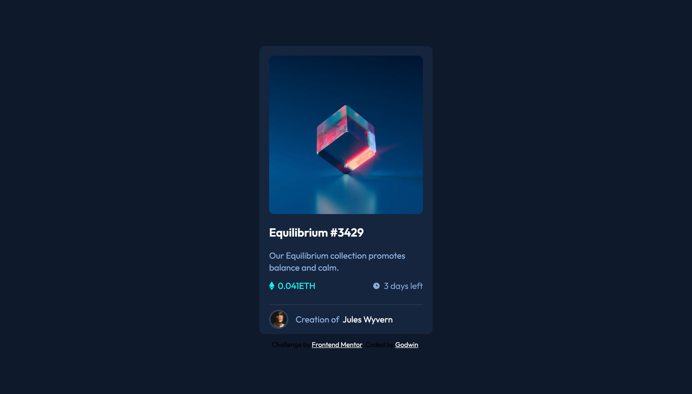
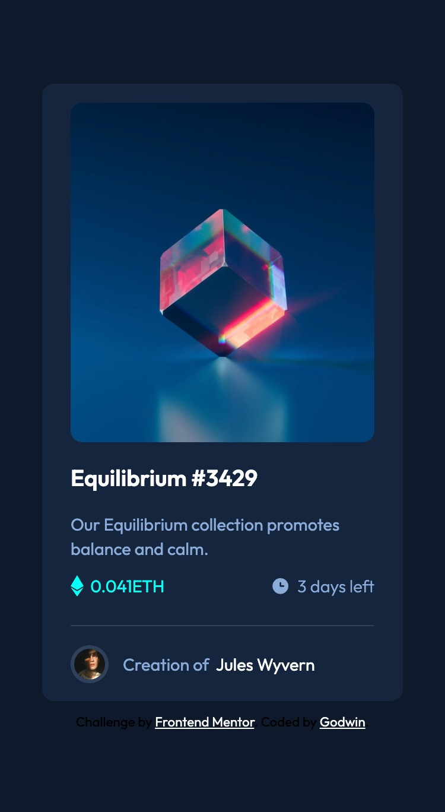

# Frontend Mentor - NFT preview card component solution

This is a solution to the [NFT preview card component challenge on Frontend Mentor](https://www.frontendmentor.io/challenges/nft-preview-card-component-SbdUL_w0U). Frontend Mentor challenges help you improve your coding skills by building realistic projects. 

## Table of contents

- [Overview](#overview)
  - [The challenge](#the-challenge)
  - [Screenshot](#screenshot)
  - [Links](#links)
- [My process](#my-process)
  - [Built with](#built-with)
  - [What I learned](#what-i-learned)
  - [Continued development](#continued-development)
- [Author](#author)

## Overview

### The challenge

Users should be able to:

- View the optimal layout depending on their device's screen size
- See hover states for interactive elements

### Screenshot
-Desktop view 

-Mobile view

### Links

- Github URL: [Git hub link](https://github.com/itadori-kun/NFT-preview-component-card.git)
- Netlify URL: [Netlify url](https://nft-card-component-preview-design.netlify.app/)

## My process

### Built with

- Semantic HTML5 markup
- CSS custom properties
- Flexbox
- Vs code extension

### What I learned

- Learnt how to overlay an icon on another image using opacity, position and transform properties.

### Continued development
Will start focusing on Javascript now and more on responsiveness of webpages across all screens.

## Author
- Frontend Mentor - [@itadori-kun](https://www.frontendmentor.io/profile/itadori-kun)
- Twitter - [@Godwincruise](https://www.twitter.com/Godwincruise)

